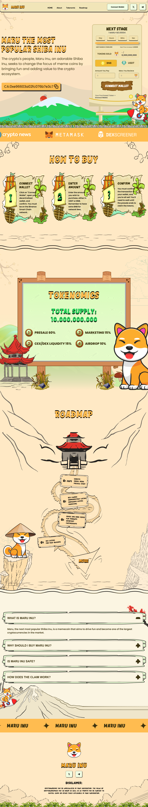

# Maru Inu Token Presale

A responsive cryptocurrency token presale landing page developed for the Maru Inu blockchain project. The website introduces the token ecosystem, tokenomics, roadmap, and presale process while providing Web3 wallet connectivity for participating in the token sale.

---

# Project Preview

---

# Overview

Maru Inu Token Presale is a modern cryptocurrency landing page built for a meme coin project on the Binance Smart Chain. The website provides investors with information about the token, presale stages, roadmap, tokenomics, and purchasing process through a clean and responsive user interface.

The project focuses on creating a visually engaging landing page while integrating a Web3-based token purchase workflow.

---

# Features

- Responsive landing page
- Cryptocurrency presale interface
- Wallet connection support
- Purchase with BNB and USDT
- Live presale progress section
- Countdown timer
- Tokenomics overview
- Project roadmap
- Frequently Asked Questions (FAQ)
- Mobile-friendly design
- Smooth scrolling and interactive animations

---

# Technologies Used

- HTML5
- CSS3
- JavaScript (ES6)
- Vite
- Ethers.js
- Binance Smart Chain (BSC)

---

# Skills Demonstrated

- Frontend Development
- Responsive Web Design
- Landing Page Development
- Web3 UI Integration
- JavaScript DOM Manipulation
- CSS Animations
- Performance Optimization
- Cross-browser Compatibility

---

# Project Purpose

This repository is shared as part of my professional portfolio to demonstrate frontend development skills, responsive landing page design, and Web3 interface implementation. Sensitive production credentials and deployment-specific configurations have been excluded.

---

# Author

**Moeen Akhtar**

Portfolio: https://www.moeenakhtar.vercel.app

GitHub: https://github.com/moeenA300

LinkedIn: https://linkedin.com/in/moeenakhtar300
